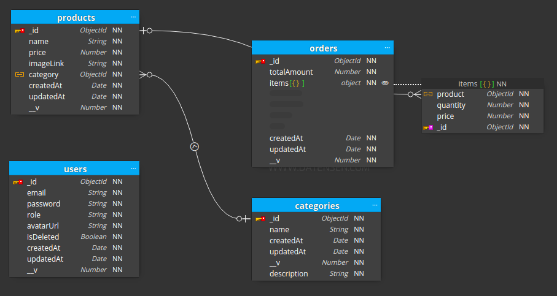

# Simple POS - backend

## Project Description

The Point of Sale App backend is designed for a small coffee shop to efficiently manage its sales operations. It facilitates the creation of shop users, product and category management, and order handling. The backend is built using Node.js, Express.js, and MongoDB.

### Admin User
- Sign in with email and password.
- Create, update, and delete categories.
- Create, update, and delete products.
- View sales statistics and generate reports for analysis.
- Update account password.
- View and manage orders placed by customers.

### Staff User
- Sign in with email and password.
- Place orders for customers.

## Diagram Relationship

*Dashboard*

## API Endpoints

The application provides the following API endpoints:

- `POST /auth/login`: Log in with username and password.
- `POST /api/users/register`: Create a new user.
- `GET /api/categories`: Get all categories.
- `POST /api/categories`: Create a new category.
- `PUT /api/categories/:categoryId`: Update a category.
- `DELETE /api/categories/:categoryId`: Delete a category.
- `GET /api/products`: Get all products.
- `GET /api/products/:productId`: Get a product by ID.
- `POST /api/products`: Create a new product.
- `PUT /api/products/:productId`: Update a product.
- `DELETE /api/products/:productId`: Delete a product.
- `PUT /api/users/:userId/password`: Update user password.
- `GET /api/orders`: Get all orders.
- `POST /api/orders`: Place an order.

## Installation and Setup

1. Clone the repository: `git clone https://github.com/dinhlab/sturdy-octo-lamp.git`
2. Install dependencies: `npm install` or `yarn install`
3. Start the development server: `npm start` or `yarn start`
